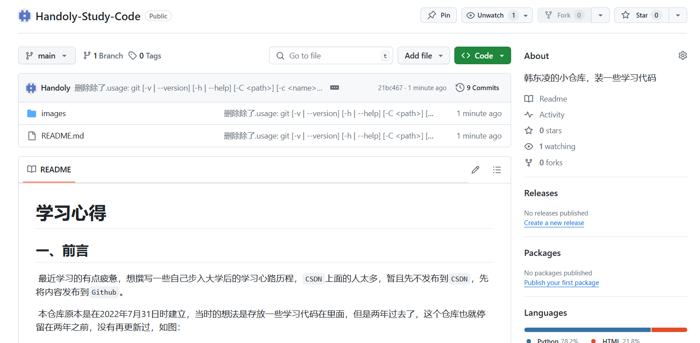
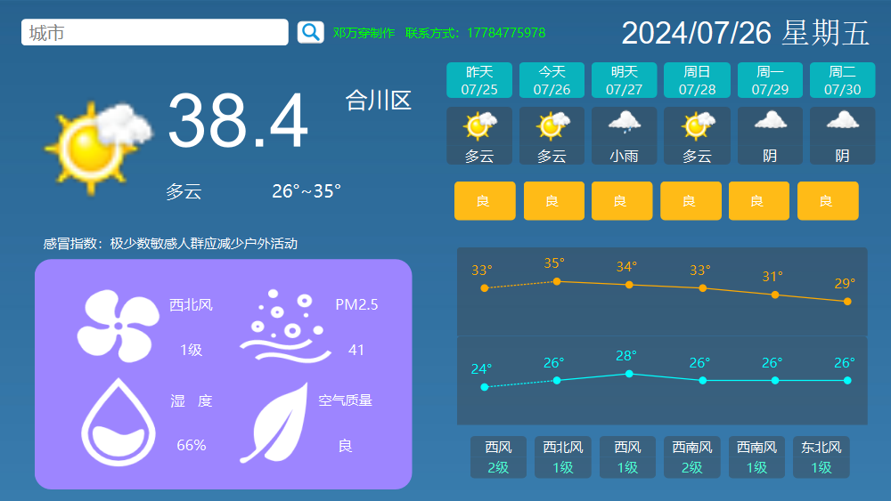
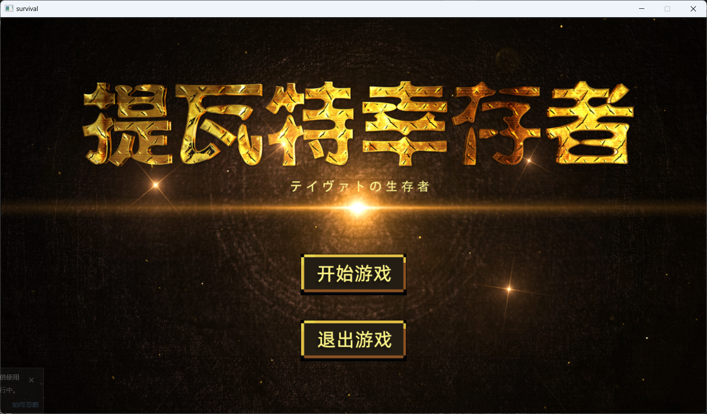
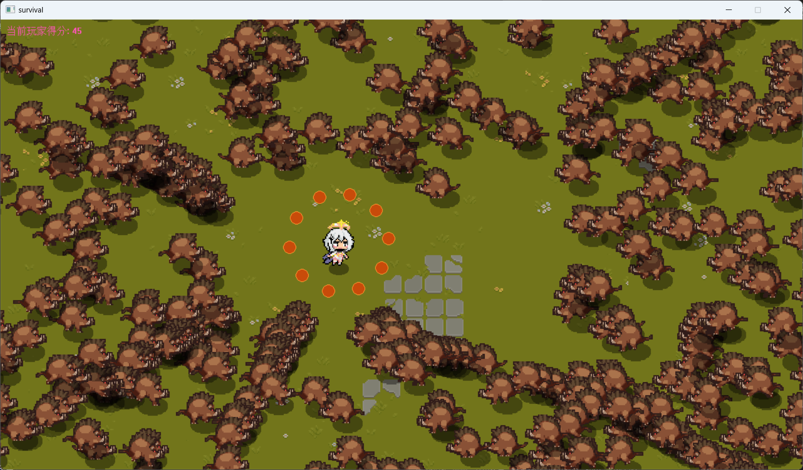

# 学习心得

## 一、前言

​	最近学习的有点疲惫，想撰写一些学习心得或者是步入大学三年以来的学习新路历程，`CSDN`上面的人太多，暂且先不发布到`CSDN`，先将内容发布到`Github`。

​	本仓库原本是在2022年7月31日时建立，当时的想法是存放一些学习代码在里面，但是两年过去了，这个仓库也就停留在两年之前，没有再更新过，如图1所示：

​	图1 原本的仓库

​	时间来到两年之后的2024年7月26日，本人决定重启这个仓库，将其作为撰写学习心得的记录本。

​	删除除了.`git`和`README.md`的其他文件，新添加images文件夹，用来存放撰写时所需要的图片，如图2所示：

图2 更新后的仓库

## 二、最近的感受

​	最近跟着哔哩哔哩的几位`up`主做了两个小项目，分别是`C++/Qt`项目--《天气预报》、`C++/easyX`项目--《提瓦特幸存者》，项目截图如图3，图4，图6所示。做完这两个项目之后，心里本来应该是收获满满，比较开心的，但是呢，我却感到异常的不安。为什么呢？本人目前是本科在读，大三升大四的阶段，面对着即将来临的秋招以及保研结果，心里十分的不踏实，因此想着做几个项目来抑制这种不踏实，可是我却发现，我做的项目越多（虽然也不多），心里越发觉得自己会的东西太少。

图3 天气预报

图4 提瓦特幸存者开始界面

图5 提瓦特幸存者游戏界面

​	如前所述，当完成这两个项目之后，觉得自己掌握的东西好少，于是本想着继续做项目，可是哔哩哔哩的视频推荐却给我推来了`Unity`、`UE5`、`虚幻引擎`等等，这时，我慢慢的发现事情不太对劲。。

​	这个暑假，我本来是想要刷`Leetcode`上面的题，但是却发现自己好多都不会写。当时为什么想要刷`LeetCode`呢? 想要找工作。于是我便去学习了B站`up`主“马士兵官方账号”的《一周刷爆`LeetCode`》的视频课程；可是我在学习过程中，发现up主用的是`java`语言，我却没有学过，老师也的确说过，语言不重要，什么语言都可以，但我却偏偏不想用自己已经学过的`python`和C，想到自己曾经在大二时接触过C++，当时是因为上数据结构这门课的老师所采用的语言，所以我便也用了这个，以此来学习`up`主的课程。在学习到链表的时候，我想着这前面的部分我都还没有实践，还没有实际动手去编写过代码，于是我便花了一段时间来编写了up主所讲过的一些排序算法，如：简单、快排、冒泡排序等等，这些其实是自己曾经在大一上数据结构的时候老师都已经讲过，只是自己忘了或者是生疏了，所以可以说是复习。在编写完之后，我却忘了继续学习算法，当时是想着感觉C++有好多东西自己没有搞明白，于是乎又跟着菜鸟教程学习了C++的Hash表、类、继承、重载、多态、Vector、文件`IOStream`、动态内存分配、`namespace`命名空间、链表、模板、进程，再学习完这些后，我还是没能想起继续学习算法，想的是我学完这些后不得做几个项目来练练手？于是我又又又去B站上搜索C++项目，看到了几个有意思的项目，最后敲定做《天气预报》这个项目。在做这个项目的过程中，因为用来Qt，而我却对Qt也不熟悉，本想着又去钻研Qt，但是这次我却没有，因为当时看了一点关于Qt学习的网页书籍，看的我头都麻了，便不打算看了，然后我便继续跟着视频做，最终完成了项目，然后又继续做了《提瓦特幸存者》的项目，在这个项目做之后，我才想起来自己已经忘了初心，我`tm`是学算法的啊！！！！`cAo`！！！然而这个时候暑假已经过去了接近1/2，距离秋招和保研结果仅剩一个多月。

