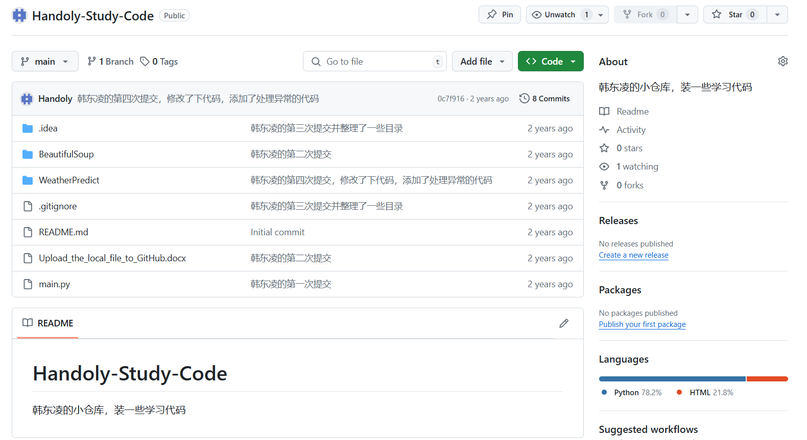

# 学习心得

## 一、前言

​	最近学习的有点疲惫，想撰写一些自己步入大学后的学习心路历程，`CSDN`上面的人太多，暂且先不发布到`CSDN`，先将内容发布到`Github`。

​	本仓库原本是在2022年7月31日时建立，当时的想法是存放一些学习代码在里面，但是两年过去了，这个仓库也就停留在两年之前，没有再更新过，如图：

​	时间来到两年之后的2024年7月26日，本人决定重启这个仓库，将其作为撰写学习心得的记录本。

​	删除除了.`git`和`README.md`的其他文件，新添加images文件夹，用来存放撰写时所需要的图片。
